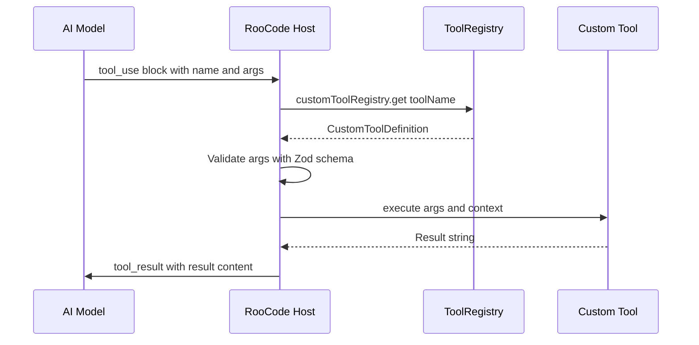
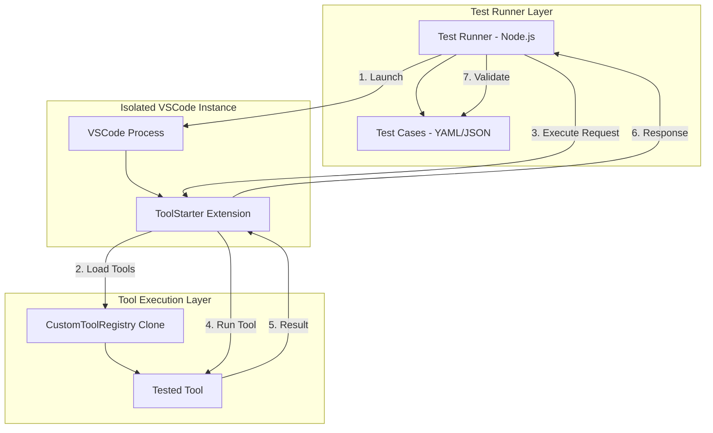

# Архитектура тестового стенда для RooCode Custom Tools

## Содержание

1. [Обзор](#обзор)
2. [Протокол RooCode Custom Tools](#протокол-roocode-custom-tools)
3. [Архитектура тестового фреймворка](#архитектура-тестового-фреймворка)
4. [Компоненты](#компоненты)
5. [Интерфейсы и контракты](#интерфейсы-и-контракты)
6. [Формат тест-кейсов](#формат-тест-кейсов)
7. [Примеры использования](#примеры-использования)

---

## Обзор

### Цель

Создание интеграционного тестового стенда для проверки custom tools, работающих в среде RooCode (VSCode extension). Тестовый стенд должен:

- Запускать custom tools в изолированной среде VSCode
- Имитировать поведение RooCode как хоста для tools
- Валидировать результаты выполнения tools
- Предоставлять масштабируемую архитектуру для добавления новых тестов

### Ключевые ограничения

- **ЗАПРЕЩЕНО** создавать импорты или ссылки на файлы внутри `3rd-projects`
- **ЗАПРЕЩЕНО** вносить изменения в тестируемые файлы (например, `src/test.ts`)
- Код RooCode используется только как справочник для понимания протокола

---

## Протокол RooCode Custom Tools

### Структура Custom Tool

```typescript
interface CustomToolDefinition {
  name: string                    // Идентификатор tool
  description: string             // Описание для AI модели
  parameters?: ZodSchema          // Zod-схема параметров (опционально)
  execute: (args, context) => Promise<string>  // Функция выполнения
}

interface CustomToolContext {
  mode: string                    // Текущий режим (code, architect, etc.)
  task: TaskLike                  // Ссылка на задачу
}
```

### Жизненный цикл выполнения Tool



### Механизм загрузки Tools

1. **Директории поиска:**
   - `.roo/tools/` в рабочей директории проекта
   - `~/.roo/tools/` в домашней директории пользователя

2. **Транспиляция:**
   - TypeScript файлы компилируются через esbuild
   - Результат кэшируется во временной директории
   - Node.js built-ins остаются внешними
   - npm пакеты бандлятся с CommonJS shim

3. **Валидация:**
   - Проверка наличия обязательных полей: `name`, `description`, `execute`
   - Проверка что `execute` является функцией
   - Проверка что `parameters` является Zod-схемой (если указан)

### Формат вызова Tool

RooCode вызывает tool со следующими аргументами:

```typescript
// Аргументы из native tool calling
const args = block.nativeArgs || block.params || {}

// Валидация через Zod (если есть схема)
const validatedArgs = customTool.parameters.parse(args)

// Вызов с контекстом
const result = await customTool.execute(validatedArgs, {
  mode: currentMode,
  task: taskInstance
})
```

---

## Архитектура тестового фреймворка

### Общая схема



### Компоненты

#### 1. Test Runner Layer

Внешний слой, работающий в Node.js среде:

- **Test Runner** - основная программа запуска тестов
- **Test Cases** - декларативное описание тестов в YAML/JSON
- **Reporter** - генерация отчётов о результатах

#### 2. Isolated VSCode Instance

Изолированный экземпляр VSCode:

- Запускается через `code` бинарник с отдельным `--user-data-dir`
- Содержит минимальную конфигурацию
- Автоматически завершается после тестов

#### 3. ToolStarter Extension

VSCode extension, имитирующий поведение RooCode:

- Загружает custom tools через CustomToolRegistry
- Предоставляет API для запуска tools
- Возвращает результаты через IPC

#### 4. Tool Execution Layer

Слой выполнения tools:

- **CustomToolRegistry Clone** - независимая копия реестра
- **Tested Tool** - тестируемый tool

---

## Компоненты

### Isolated Runner

#### Назначение

Управление жизненным циклом изолированного экземпляра VSCode.

#### Структура директории

```
test-framework/
├── isolated-runner/
│   ├── src/
│   │   ├── runner.ts           # Основной класс Runner
│   │   ├── vscode-launcher.ts  # Запуск VSCode
│   │   ├── ipc-client.ts       # IPC коммуникация
│   │   └── workspace-setup.ts  # Создание тестового workspace
│   └── package.json
```

#### Ключевые интерфейсы

```typescript
interface IsolatedRunnerConfig {
  vscodePath?: string            // Путь к code бинарнику (по умолчанию: code)
  userDataDir: string            // Директория для user data
  extensionsDir: string          // Директория для extensions
  workspaceDir: string           // Тестовый workspace
  timeout: number                // Таймаут запуска (ms)
}

interface IsolatedRunner {
  start(): Promise<void>
  stop(): Promise<void>
  executeTool(request: ToolExecutionRequest): Promise<ToolExecutionResult>
  isRunning(): boolean
}
```

#### Запуск VSCode

```bash
code \
  --user-data-dir=/tmp/test-vscode-userdata \
  --extensions-dir=/tmp/test-vscode-extensions \
  --extensionDevelopmentPath=/path/to/toolstarter-extension \
  --wait \
  /path/to/test/workspace
```

**Ключевые флаги:**
- `--user-data-dir` - изолированная директория пользовательских данных
- `--extensionDevelopmentPath` - путь к разрабатываемому extension
- `--wait` - ожидание полной активации extension перед продолжением
- `--disable-extensions` - отключение всех других расширений
- `--no-sandbox` - отключение sandbox для тестовой среды

### ToolStarter Extension

#### Назначение

VSCode extension, который:
- Загружает custom tools из указанной директории
- Предоставляет IPC API для внешних клиентов
- Выполняет tools и возвращает результаты

#### Структура директории

```
test-framework/
├── toolstarter-extension/
│   ├── src/
│   │   ├── extension.ts        # Точка входа extension
│   │   ├── tool-host.ts        # Хост для tools (имитация RooCode)
│   │   ├── ipc-server.ts       # IPC сервер
│   │   └── tool-registry.ts    # Копия CustomToolRegistry
│   ├── package.json
│   └── tsconfig.json
```

#### Ключевые интерфейсы

```typescript
interface ToolHost {
  loadTools(toolsDir: string): Promise<LoadResult>
  executeTool(name: string, args: any, context: MockContext): Promise<string>
  listTools(): string[]
}

interface MockContext {
  mode: string
  task: MockTask
}

interface MockTask {
  taskId: string
  // Минимальная реализация TaskLike для тестов
}
```

#### IPC протокол

Extension открывает TCP сервер на порту **9234** (настраивается через `TOOLSTARTER_IPC_PORT`):

```typescript
interface ToolExecutionRequest {
  id: string                     // ID запроса
  toolName: string               // Имя tool
  args: Record<string, any>      // Аргументы
  context: MockContext           // Контекст выполнения
}

interface ToolExecutionResponse {
  id: string                     // ID запроса
  success: boolean               // Успешность
  result?: string                // Результат (если success=true)
  error?: string                 // Ошибка (если success=false)
  duration: number               // Время выполнения (ms)
}
```

**Настройка порта:**
- По умолчанию: `9234`
- Переменная окружения: `TOOLSTARTER_IPC_PORT`
- Передаётся в extension при запуске VSCode

### Test Logic Layer

#### Назначение

Декларативное описание и выполнение тестов.

#### Структура директории

```
test-framework/
├── test-logic/
│   ├── src/
│   │   ├── index.ts           # Точка входа (ESM экспорт runCLI)
│   │   ├── test-runner.ts     # Основной runner
│   │   ├── test-case-loader.ts # Парсер YAML тест-кейсов
│   │   ├── reporter.ts        # Генерация отчётов
│   │   └── types.ts           # Типы и интерфейсы
│   ├── dist/                  # Скомпилированные JS файлы
│   ├── package.json           # type: "module" (ESM)
│   └── tsconfig.json
```

#### ESM-совместимость

Пакет `test-logic` использует ESM (ECMAScript Modules):

```json
// package.json
{
  "type": "module",
  "main": "dist/index.js"
}
```

Импорт в CLI:
```typescript
// cli.ts
import { runCLI } from './test-logic/dist/index.js';
```

#### Формат тест-кейса

```yaml
# test-cases/tommorow-basic.yaml
name: tommorow - basic test
description: Проверка базовой функциональности tool tommorow

tool:
  path: ../../../src/test.ts    # Путь к тестируемому tool
  name: tommorow

test-scenarios:
  - name: "Default execution"
    description: "Выполнение без параметров"
    args: {}
    context:
      mode: code
    expected:
      success: true
      result:
        contains: "хорошо"       # Результат должен содержать "хорошо"
        
  - name: "With architect mode"
    description: "Выполнение в режиме architect"
    args: {}
    context:
      mode: architect
    expected:
      success: true
      result:
        contains: "хорошо"
```

---

## Интерфейсы и контракты

### Core Interfaces

```typescript
// === Test Case Definition ===

interface TestCase {
  name: string
  description: string
  tool: ToolReference
  testScenarios: TestScenario[]
}

interface ToolReference {
  path: string                   // Относительный путь к .ts файлу
  name: string                   // Ожидаемое имя tool
}

interface TestScenario {
  name: string
  description: string
  args: Record<string, any>
  context: Partial<MockContext>
  expected: ExpectedResult
}

interface ExpectedResult {
  success: boolean
  result?: ResultMatcher
  error?: ErrorMatcher
  duration?: DurationMatcher
}

// === Result Matchers ===

type ResultMatcher = 
  | { equals: string }           // Точное совпадение
  | { contains: string }         // Содержит подстроку
  | { matches: string }          // Regex паттерн
  | { jsonSchema: object }       // JSON Schema валидация

type ErrorMatcher =
  | { contains: string }
  | { matches: string }
  | { code: string }

type DurationMatcher =
  | { lessThan: number }         // Меньше чем (ms)
  | { greaterThan: number }      // Больше чем (ms)
  | { between: [number, number] } // В диапазоне (ms)

// === Execution Results ===

interface TestExecutionResult {
  testCase: string
  scenario: string
  passed: boolean
  actual: ToolExecutionResponse
  expected: ExpectedResult
  duration: number
  error?: string
}

interface TestReport {
  timestamp: string
  totalTests: number
  passed: number
  failed: number
  skipped: number
  results: TestExecutionResult[]
}
```

### IPC Protocol

```typescript
// === Request/Response over TCP or stdio ===

interface IPCMessage {
  type: 'request' | 'response' | 'event'
  id: string
  payload: any
}

// Events
interface ToolLoadedEvent {
  type: 'tool:loaded'
  tools: string[]
}

interface ToolErrorEvent {
  type: 'tool:error'
  toolName: string
  error: string
}
```

---

## Формат тест-кейсов

### Полный пример

```yaml
# test-cases/example-full.yaml

# Метаданные теста
name: "My Tool - Full Test Suite"
description: "Комплексное тестирование my_tool"
author: "Developer"
version: "1.0.0"

# Ссылка на тестируемый tool
tool:
  path: ../../tools/my-tool.ts
  name: my_tool

# Настройки окружения
environment:
  nodeVersion: ">=18.0.0"
  timeout: 30000

# Тестовые сценарии
testScenarios:
  # Сценарий 1: Успешное выполнение
  - name: "Success case"
    description: "Корректные параметры, ожидаемый результат"
    args:
      input: "test data"
      options:
        verbose: true
    context:
      mode: code
    expected:
      success: true
      result:
        contains: "processed"
      duration:
        lessThan: 5000

  # Сценарий 2: Обработка ошибки
  - name: "Invalid input"
    description: "Некорректные входные данные"
    args:
      input: ""  # Пустая строка - ошибка
    context:
      mode: code
    expected:
      success: false
      error:
        contains: "input required"

  # Сценарий 3: Разные режимы
  - name: "Architect mode"
    description: "Выполнение в режиме architect"
    args:
      input: "design doc"
    context:
      mode: architect
    expected:
      success: true
      result:
        matches: ".*design.*processed.*"
```

### Пример для tommorow tool

```yaml
# test-cases/tommorow.yaml

name: "tommorow - Unit Tests"
description: "Тестирование tool для получения прогноза на завтра"

tool:
  path: ../../../src/test.ts
  name: tommorow

testScenarios:
  - name: "Basic execution"
    description: "Базовый вызов без параметров"
    args: {}
    context:
      mode: code
    expected:
      success: true
      result:
        contains: "хорошо"

  - name: "Architect mode execution"
    description: "Вызов в режиме architect"
    args: {}
    context:
      mode: architect
    expected:
      success: true
      result:
        contains: "хорошо"

  - name: "Result format validation"
    description: "Проверка формата результата"
    args: {}
    context:
      mode: code
    expected:
      success: true
      result:
        matches: ".*Завтра.*хорошо.*"
```

---

## Примеры использования

### Запуск тестов

```bash
# Сборка и запуск всех тестов
cd test-framework
npm run build
node cli.js test

# Запуск конкретного тест-кейса
node cli.js test --file test-cases/test-tomorrow.yaml

# Запуск с детальным выводом
node cli.js test --verbose

# Указание таймаута
node cli.js test --timeout 60000

# Генерация отчёта в JUnit формате
node cli.js test --reporter junit --output results.xml
```

### Результат успешного теста

При успешном выполнении теста вывод выглядит следующим образом:

```
[TestRunner] Loading test case: test-cases/test-tomorrow.yaml
[VSCodeManager] Starting VSCode: code --user-data-dir /tmp/test-vscode-userdata ...
[IPCClient] Connected to IPC server on port 9234
[TestRunner] Running test: tommorow - basic test
  ✓ Basic execution (123ms)
  ✓ Result contains expected text
[TestRunner] Test passed: tommorow - basic test
[VSCodeManager] Stopping VSCode...

Summary:
  Passed: 1
  Failed: 0
  Total: 1
```

### Программный API

```typescript
import { TestRunner } from './test-framework/test-runner'

async function runTests() {
  const runner = new TestRunner({
    vscodePath: 'code',
    workspaceDir: './test-workspace',
    timeout: 60000
  })

  // Загрузка тест-кейсов
  await runner.loadTestCases('./test-cases/*.yaml')

  // Выполнение тестов
  const report = await runner.runAll()

  // Вывод результатов
  console.log(`Passed: ${report.passed}/${report.totalTests}`)
  console.log(`Failed: ${report.failed}`)

  // Генерация отчёта
  await runner.generateReport(report, 'junit', 'test-results.xml')
}
```

### Интеграция с CI/CD

```yaml
# .github/workflows/test-tools.yml
name: Test Custom Tools

on: [push, pull_request]

jobs:
  test:
    runs-on: ubuntu-latest
    steps:
      - uses: actions/checkout@v4
      
      - name: Setup Node.js
        uses: actions/setup-node@v4
        with:
          node-version: '20'
      
      - name: Install dependencies
        run: npm ci
      
      - name: Run tool tests
        run: npm run test:tools -- --reporter junit --output test-results.xml
      
      - name: Publish test results
        uses: dorny/test-reporter@v1
        if: always()
        with:
          name: Tool Tests
          path: test-results.xml
          reporter: jest-junit
```

---

## Структура директорий тестового фреймворка

```
test-framework/
├── ARCHITECTURE.md              # Этот документ
├── README.md                    # Инструкция по использованию
├── package.json                 # Зависимости и скрипты (workspaces)
├── cli.ts                       # CLI исходник (TypeScript)
├── cli.js                       # Скомпилированный CLI (ESM)
├── run-test.sh                  # Скрипт запуска тестов
│
├── runner/                      # Isolated Runner компонент
│   ├── src/
│   │   ├── index.ts             # Точка входа
│   │   ├── vscode-manager.ts    # Управление VSCode процессом
│   │   ├── ipc-client.ts        # IPC коммуникация
│   │   └── types.ts             # Типы и интерфейсы
│   ├── package.json
│   └── tsconfig.json
│
├── toolstarter/                 # VSCode Extension компонент
│   ├── src/
│   │   ├── index.ts             # Точка входа
│   │   ├── extension.ts         # VSCode extension активация
│   │   ├── ipc-server.ts        # IPC сервер (порт 9234)
│   │   ├── tool-loader.ts       # Загрузка tools
│   │   ├── tool-registry.ts     # Реестр tools
│   │   ├── validator.ts         # Валидация tools
│   │   └── types.ts             # Типы и интерфейсы
│   ├── package.json
│   └── tsconfig.json
│
├── test-logic/                  # Test Logic Layer компонент
│   ├── src/
│   │   ├── index.ts             # Точка входа (ESM экспорт)
│   │   ├── test-runner.ts       # Запуск тестов
│   │   ├── test-case-loader.ts  # Загрузка YAML тест-кейсов
│   │   ├── reporter.ts          # Генерация отчётов
│   │   └── types.ts             # Типы и интерфейсы
│   ├── package.json             # type: "module" (ESM)
│   └── tsconfig.json
│
├── test-cases/                  # Тест-кейсы (YAML)
│   ├── test-tomorrow.yaml       # Тест для tommorow tool
│   └── examples/                # Примеры тест-кейсов
│       ├── example-json-response.yaml
│       └── example-with-params.yaml
│
└── test-workspace/              # Временный workspace для тестов
    └── .roo/
        └── tools/               # Симлинки на тестируемые tools
```

---

## Quick Start

### Предварительные требования

- Node.js 18+
- VSCode установлен и доступен в PATH как `code`
- npm пакеты установлены: `npm install`

### Быстрый старт

1. **Сборка фреймворка:**
   ```bash
   cd test-framework
   npm run build
   ```

2. **Запуск тестов через npm:**
   ```bash
   # Запуск всех тестов
   npm test
   
   # Запуск с подробным выводом
   npm run test:verbose
   
   # Запуск конкретного тест-кейса
   npm run test:file test-cases/test-tomorrow.yaml
   
   # Генерация JUnit отчёта
   npm run test:junit
   ```

3. **Запуск тестов через скрипт:**
   ```bash
   # Запуск всех тестов
   ./run-test.sh
   
   # Запуск конкретного тест-кейса
   ./run-test.sh test-cases/test-tomorrow.yaml
   
   # Запуск с дополнительными аргументами
   ./run-test.sh --verbose --timeout 60000
   ```

4. **Запуск через CLI напрямую:**
   ```bash
   # Запуск теста
   node cli.js test test-cases/test-tomorrow.yaml
   
   # С детальным выводом
   node cli.js test --verbose test-cases/test-tomorrow.yaml
   
   # Указание таймаута
   node cli.js test --timeout 60000 test-cases/test-tomorrow.yaml
   ```

### Примеры использования CLI

```bash
# Показать справку
node cli.js --help

# Запуск конкретного тест-кейса
node cli.js test test-cases/test-tomorrow.yaml

# Запуск всех тестов в директории
node cli.js test test-cases/

# Запуск с детальным логированием
node cli.js test --verbose test-cases/test-tomorrow.yaml

# IPC порт настраивается через переменную окружения (по умолчанию 9234)
TOOLSTARTER_IPC_PORT=9234 node cli.js test test-cases/test-tomorrow.yaml
```

### Создание нового тест-кейса

1. Создайте YAML файл в `test-cases/`:
   ```yaml
   name: "My Tool Test"
   description: "Тестирование моего tool"
   
   testCases:
     - id: "basic-test"
       description: "Базовый тест"
       toolPath: "../src/my-tool.ts"
       toolName: "my_tool"
       params: {}
       expected:
         success: true
         contains: "ожидаемый текст"
   ```

2. Запустите тест:
   ```bash
   ./run-test.sh test-cases/my-tool-test.yaml
   ```

---

## Troubleshooting

### Проблема: VSCode не запускается

**Симптомы:**
- Ошибка `Failed to start VSCode`
- Timeout при ожидании подключения

**Решения:**
1. Убедитесь, что VSCode доступен в PATH:
   ```bash
   which code
   code --version
   ```

2. Если используется нестандартный путь, укажите его в конфигурации:
   ```typescript
   const runner = new IsolatedRunner({
     vscodePath: '/path/to/code',
     // ...
   });
   ```

3. Проверьте логи VSCode:
   ```bash
   code --verbose --user-data-dir=/tmp/test-vscode-userdata
   ```

### Проблема: IPC подключение не удаётся

**Симптомы:**
- Ошибка `Failed to connect to IPC server`
- Timeout при подключении

**Решения:**
1. Проверьте, что порт свободен:
   ```bash
   lsof -i :9234
   netstat -tlnp | grep 9234
   ```

2. Убедитесь, что extension загружен:
   - Откройте VSCode вручную с теми же параметрами
   - Проверьте Output Channel "ToolStarter"

3. Увеличьте количество попыток подключения:
   ```typescript
   await ipcClient.connect(20, 2000); // 20 попыток, 2 секунды между ними
   ```

### Проблема: Tool не загружается

**Симптомы:**
- Ошибка `Failed to load tool`
- Tool не найден в registry

**Решения:**
1. Проверьте путь к tool в тест-кейсе:
   ```yaml
   toolPath: "../src/test.ts"  # Относительно test-cases/
   ```

2. Убедитесь, что tool экспортируется правильно:
   ```typescript
   export default defineCustomTool({
     name: "tommorow",  // Имя должно совпадать с toolName в тесте
     // ...
   });
   ```

3. Проверьте зависимости tool - они должны бандлиться или быть внешними:
   ```typescript
   // Зависимости Node.js остаются внешними
   import { readFileSync } from 'fs';  // OK
   
   // npm пакеты должны быть в dependencies или бандлиться
   import { z } from 'zod';  // Должен быть в dependencies
   ```

### Проблема: Валидация не проходит

**Симптомы:**
- Тест падает с `Validation failed`
- Результат не соответствует expected

**Решения:**
1. Проверьте точное содержимое результата:
   ```yaml
   expected:
     contains: "хорошо"  # Точное совпадение подстроки
   ```

2. Используйте regex для гибкой проверки:
   ```yaml
   expected:
     matches: ".*Завтра.*хорошо.*"
   ```

3. Для JSON результатов используйте jsonSchema:
   ```yaml
   expected:
     jsonSchema:
       type: "object"
       properties:
         status:
           type: "string"
   ```

### Проблема: Timeout при выполнении теста

**Симптомы:**
- Ошибка `Request timeout`
- Тест выполняется слишком долго

**Решения:**
1. Увеличьте timeout в тест-кейсе:
   ```yaml
   timeout: 60000  # 60 секунд
   ```

2. Проверьте, что tool не зависает:
   ```typescript
   async execute(args, context) {
     // Добавьте таймаут для долгих операций
     const result = await Promise.race([
       longOperation(),
       new Promise((_, reject) =>
         setTimeout(() => reject(new Error('Timeout')), 30000)
       )
     ]);
     return result;
   }
   ```

### Проблема: Extension не активируется

**Симптомы:**
- VSCode запускается, но IPC сервер не отвечает
- Нет логов в Output Channel

**Решения:**
1. Проверьте `activationEvents` в package.json extension:
   ```json
   {
     "activationEvents": ["*"],
     "main": "./out/extension.js"
   }
   ```

2. Соберите extension:
   ```bash
   cd test-framework/toolstarter
   npm run compile
   ```

3. Проверьте логи VSCode:
   - Откройте Developer Tools: Help > Toggle Developer Tools
   - Проверьте Console на ошибки

### Отладка

Для детальной отладки включите verbose режим:

```bash
# CLI с verbose
node cli.js test --verbose test-cases/test-tomorrow.yaml

# Или через скрипт
./run-test.sh --verbose
```

Логи IPC сервера доступны в Output Channel "ToolStarter" в VSCode.

---

## Следующие шаги

1. **Реализация Isolated Runner** ✅
   - Создание базовой структуры
   - Реализация запуска VSCode
   - IPC коммуникация

2. **Реализация ToolStarter Extension** ✅
   - Копирование CustomToolRegistry (без ссылок на 3rd-projects)
   - Реализация ToolHost
   - IPC сервер

3. **Реализация Test Runner** ✅
   - Парсер YAML тест-кейсов
   - Валидация результатов
   - Генерация отчётов

4. **Тестирование** ✅
   - Создание тест-кейсов для `src/test.ts`
   - Интеграционное тестирование фреймворка
   - Документация
